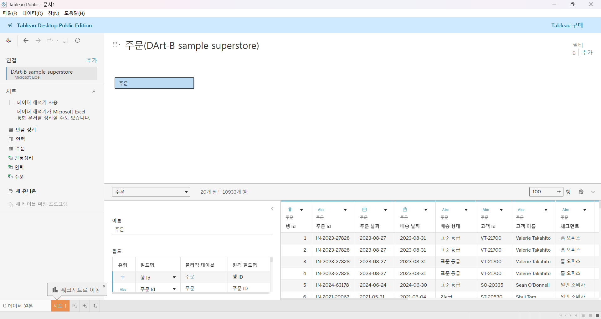

# Tableau 1주차 정규과제
 
📌Tableau 정규과제는 매주 정해진 **유튜브 강의를 통해 태블로 이론 및 기능을 학습한 후, 실습 문제를 풀어보며 이해도를 높이는 학습 방식**입니다. 

이번주는 아래의 **Tableau_1st_TIL**에 명시된 유튜브 강의를 먼저 수강해주세요. 학습 중에는 주요 개념을 스스로 정리하고, 이해가 어려운 부분은 강의 자료나 추가 자료를 참고해 보완하세요. 과제 작성이 끝난 이후에는 **Github에 TIL과 실습 인증 결과를 업로드 후, 과제 시트에 제출해주세요.**


**(수행 인증샷은 필수입니다.)** 

> 태블로를 활용하는 과제인 경우, 따로 캡쳐도구를 사용하여 이미지를 첨가해주세요.


## Tableau_1st_TIL

### 01. 태블로 설치

### 02. 태블로 연결

### 03. 데이터 연결과 데이터 유형

### 04. 데이터 결합과 관계

### 05. 데이터 결합과 조인

### 06. 데이터 결합과 혼합

### 07. 데이터 결합과 유니온

### 08. 라이브와 추출

### 09. 데이터 형식


<br>

## 주차별 학습 (Study Schedule)

| 주차  | 공부 범위          | 완료 여부 |
| ----- | ------------------ | --------- |
| 1주차 | **강의 1 ~ 9강**   | ✅         |
| 2주차 | **강의 10 ~ 19강** | 🍽️         |
| 3주차 | **강의 20 ~ 29강** | 🍽️         |
| 4주차 | **강의 30 ~ 39강** | 🍽️         |
| 5주차 | **강의 40 ~ 49강** | 🍽️         |
| 6주차 | **강의 50 ~ 59강** | 🍽️         |
| 7주차 | **강의 60 ~ 69강** | 🍽️         |

<!-- 여기까진 그대로 둬 주세요-->


---

# 1️⃣ 학습 내용 정리

## 1강. 태블로설치


<!-- 태블로 Desktop은 유료 혹은 사용자 인증이 되어야 하므로, 사용 경험이 없으시다면 우선 Tableau Public으로 학습하는 것을 권장드립니다. -->


## 2강. 태블로연결


> **🧞‍♀️ 데이터 해석기는 어떤 경우 사용하나요?**

```
데이터 해석기를 지원하는 커넥터에서 병합된 셀, 메모, 바닥글, 빈 셀 등을 감지하고 이를 무시하여 데이터 집합의 실제 필드와 값을 식별할 수 있게하는 기능이다.데이터 연결 시 태블로가 읽기 쉽게 해야하나 그렇지 않은 경우 사용한다.
```


> **🧞‍♀️ 깃허브 assignment 폴더의 DArt-B Sample Store.xls 파일을 다운받고 시트 중 '주문' 시트를 불러와주세요.**

<!-- 캡쳐 파일을 첨부해주세요! 캡쳐하는 법은 깃허브 강의 영상에 있습니다 (폴더 생성 후 폴더 안에 이미지 넣기 + 불러오기) -->

<!-- 문제와 문제 풀이가 모두 위 DArt-B Sample Store.xls 파일을 기반으로 제시되므로, 해당 엑셀파일을 사용하셔야 혼동이 없습니다. -->



## 3강. 데이터연결과 데이터 유형


> **🧞‍♀️ 라이브와 추출의 차이가 무엇인가요? 어떤 경우 사용하나요?**


```
**라이브**
태블로가 데이터에 직접 연결하는 형태
원본에 변화가 생기면 작업하던 것에도 변화
데이터 양이 많아지면 성능 저하

**추출**
하이퍼 파일 생성
하이퍼는 태블로의 인메모리 데이터 엔진 기술
현재 데이터 원본을 하이퍼 형태로 저장
오프라인 상태에서도 추출 파일로 작업 가능
라이브에 비해 성능 및 속도 좋음
원본에 변화 -> 새로고침 후 작업
```


## 4강. 데이터결합과 관계

<!-- 데이터 결합과 관계에 대해 알게 된 점을 자유로이 적어보세요.-->

> **🧞‍♀️ 어떤 경우에 관계를, 어떤 경우에 조인을 사용하나요?**

```
관계로 결합
원본 데이터를 더 독립적으로 활용 가능
결합하려는 데이터의 유형이 동일해야함
독립적으로 원본 활용 가능
데이터를 더 유연하게 활용 가능
조인에서 발생하는 데이터 중복 문제 방지

```


## 5강. 데이터결합과 조인

<!-- 데이터 결합과 조인에 대해 알게 된 점을 적고, 아래 질문에 답해보세요 :) -->

주문 중 '반품된' 주문만을 가지고 분석을 진행하려고 합니다.

> **🧞‍♀️ 해당 목적 달성을 위해서 Sample store 데이터셋의 어떤 시트를 조인(혹은 릴레이션)해야 할까요? 조인키는 무엇인지, (inner, outer, left, right) 조인 유형은 무엇일지 논의해주세요.**

Inner Join
두 테이블 모두의 일치하는 항목만 표시

Left / Right Join
한쪽 테이블의 모든 값과 반대쪽 테이블의 일치하는 값을 표시

Outer Join
두 테이블의 모든 값을 완전히 포함하는 테이블 생성


데이터를 조인한 데이터 원본 창의 캡쳐를 첨부해주세요.
몇 개의 주문이 반품되었다고 표시되나요?

<!-- 캡쳐 이미지를 첨부해주세요 -->

3027개


## 6강. 데이터결합 혼합

<!-- 데이터결합 및 혼합에 대해 알게 된 점을 적어주세요 -->
혼합

    관계나 조인과 달리 데이터를 실제로 결합하지는 않음

    각 데이터 원본을 독립적으로 결과를 집계한 후에 한 시트에서 데이터를 시각화할 수 있게 함

    실제 혼합된 데이터 원본은 없고 여러 데이터 원본에 혼합된 결과만을 화면에 나타냄

    기술적 제한이 있을 경우에만 사용 권장


## 7강. 데이터 결합과 유니온

유니온

     한 테이블의 행을 다른 테이블에 추가하여 데이터를 결합하는 방법


> **🧞‍♀️ 유니온을 사용하기 위한 전제 조건은 무엇인가요?**

데이터의 테이블 구조가 동일해야함

각 테이블의 수가 같고, 관련 필드의 필드 이름과 데이터 유형이 일치해야함

## 8강. 라이브와 추출 

<!-- 라이브와 추출에 대해 알게 된 점을 적어주세요 -->

> **🧞‍♀️ 라이브와 추출 방법의 차이가 무엇인가요? 어떤 경우에 추출을 사용하면 좋을까요?**
데이터의 실시간 업데이트

라이브
- 데이터 원본의 변경사항이 그대로 연결되어 실시간으로 정보가 업데이트됨

추출
- 로컬, 온-프레미스 데이터 상관없이 원본에서 업데이트를 수신하려면 추출을 새로고침해야함

- 추출은 집계에 최적화 되고 시스템 메모리에 로드 되어 시각화를 빠르게 호출하는 데이터의 스냅샷으로 특히 대규모 데이터 세트, 필터, 계산 등이 포함된 보다 복잡한 시각화에서 라이브 연결보다 빠름

- ex) 병원에서 환자의 상태를 2일간 혹은 주간 추세로 체크해야하는 경우


**참고자료 : 온프레미스 데이터란?**

기업이나 조직이 자체적으로 보유한 물리적 서버나 데이터 센터 내에서 직접 관리하는 데이터로, 조직 내의 하나 이상 서버에서 통제됩니다. 본 서버들은 기업의 데이터센터나 물리적 위치에 설치되어 있으며, 네트워크를 통해 해당 데이터에 접근하고 관리할 수 있습니다.


## 9강. 데이터형식

<!-- 데이터형식에 대해 알게 된 점을 적어주세요 -->
데이터 형식
- 실수, 정수 문자형은 # 모양
- 날짜와 시각 필드는 달력 모양
- 문자열은 Abc
- bool - Truth & False
- 지리적 역할은 지구본
<br>
<br>


# 2️⃣ 확인 문제

## 문제 1.

> **🧚푸앙이는 아래 사진과 같이 2024년 3월부터 7월까지의 지하철 승하차 이용객 데이터를 가지고 있습니다. 월별로 데이터셋이 나누어진 상태며, 푸앙이는 해당 데이터셋 5개 모두를 한 번에 시각화하려 합니다. 필드 값(컬럼)의 이름, 데이터 유형, 개수는 모두 같습니다.**


> **이때, '조인, 관계, 혼합, 유니온' 중 본 목적에 적합한 결합 방법은 무엇인가요? 하나씩 드래그하지 않고, 와일드카드를 이용해 모든 데이터를 빠르게 결합해보세요.**


~~~
유니온
월별 동일한 구조의 데이터를 쌓아 올릴 때 사용
→ 202403 ~ 202407 데이터를 하나의 테이블로 합치려면 유니온이 맞습니다.

조인
두 개 테이블에 공통 키가 있고, 그걸 기준으로 추가 컬럼을 붙일 때 사용
(예: 승차 인원 데이터 + 날씨 데이터)

관계
Tableau에서 테이블 간의 관계를 유지하면서 필요한 시점에 조인이 이루어지도록 설정하는 방법

혼합
서로 다른 데이터 소스를 동시에 사용할 때 필요

월별 지하철 승하차 CSV 5개 합치기는 유니온이 적합
~~~


## 문제 2.

> **🧚푸앙이는 태블로를 사용하여 회사의 매출 데이터를 시각화하려고 합니다. 태블로에서는 데이터를 연결하는 두 가지 방식인 라이브 연결과 추출 연결이 있습니다. 두 방식 중 어떤 것을 사용할지 고민 중입니다. 다음의 일상생활 사례를 바탕으로, 어떤 상황에서 라이브 연결이 적합하고, 어떤 상황에서 추출 연결이 더 적합한지 설명하세요.**

1. 사례 1: 실시간 주식 시세 확인
주식 거래를 하고 있는 수금의왕 푸앙이는 주식 시세가 매 순간 변동하는 실시간 데이터를 필요로 합니다. 이 데이터를 기반으로 빠르게 결정을 내려야 합니다.


```
주식 시세는 매 순간 변동 → 항상 최신 데이터 필요

라이브
→ 데이터베이스에 직접 연결해서 변하는 데이터를 바로 시각화할 수 있음
→ 단점: 속도가 느리거나 네트워크 불안정 시 시각화가 지연될 수 있음
```


2. 사례 2: 푸앙이는 저번 주 제주도로 여행을 갔었어요. 비행 중에 예산 계획을 세우려 하는데, 인터넷 연결이 불안정할 것 같아요. 여행 전 미리 예산 데이터를 다운로드해서 오프라인에서도 사용할 수 있으면 좋겠습니다.


```
미리 데이터를 받아두고, 인터넷 없이도 분석 필요

추출 
→ 데이터를 미리 다운로드해서 로컬에 저장 후 사용 가능
→ 오프라인 환경에서도 분석/시각화가 가능하고, 속도도 빠름
```


## 참고 자료

>  **데이터 분석을 하다보면 지역별로 경향을 알아보고자 할 때가 많습니다. 태블로에서는 시/도, 시군구명을 칼럼으로 가지고 있고, 그걸 지리적 위치로 바꿔주면 지도에서 위치를 인식하는데요. 하지만 읍면동(행정동) 단위까지 인식하지는 못합니다. 그럼 어떻게 읍면동 단위까지 세분화하여 표기할 수 있을까요? 이때 방금 배운 데이터 릴레이션 혹은 조인을 사용합니다. 맵 그래프는 지금 배울 부분은 아니지만, 데이터 병합에 관련된 부분이기에 필요하신 분들을 위해 아래 링크를 걸어두겠습니다.**


바로 읍면동의 경계를 가지고 있는 shp, geojson 등 공간파일을 원본데이터와 머지하는 것입니다.

링크: https://subinze.tistory.com/m/2

<br>

<br>

### 🎉 수고하셨습니다.
