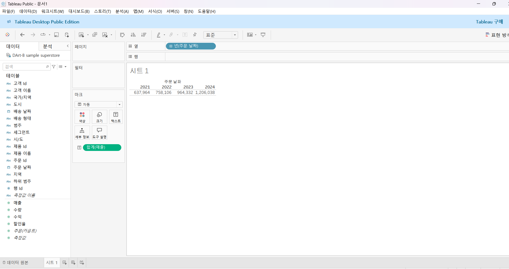
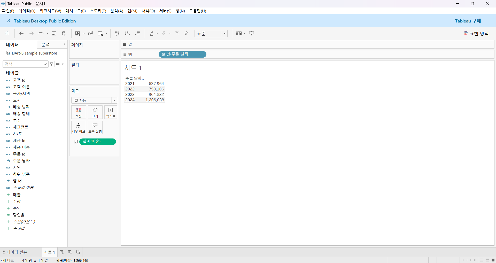
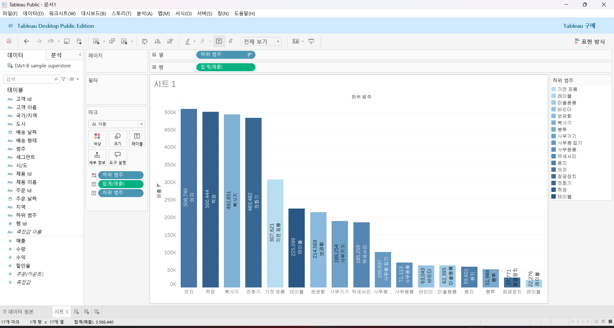
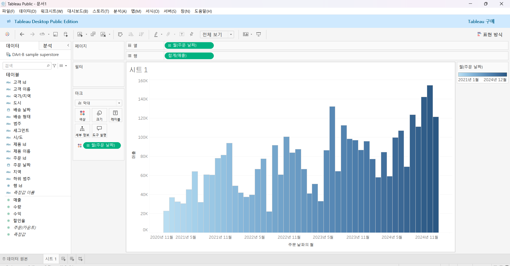
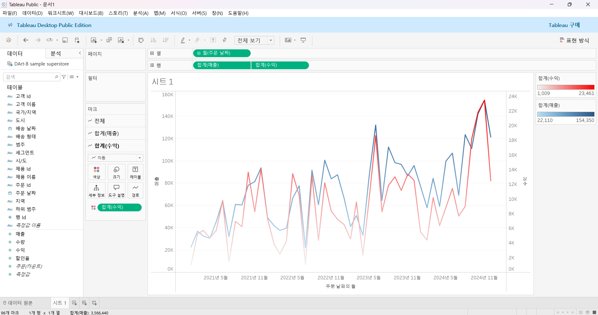
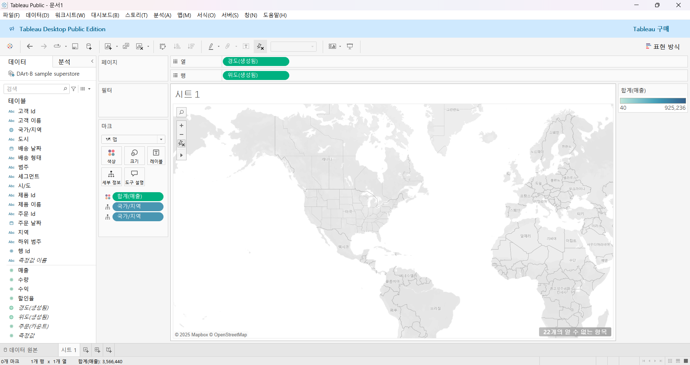
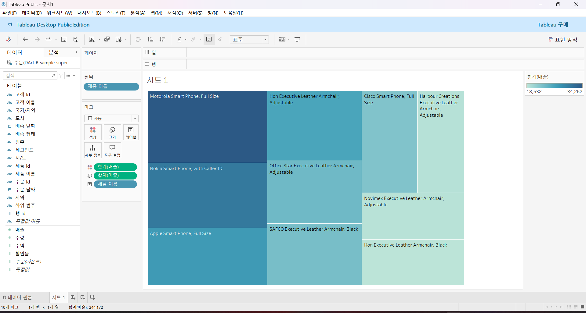
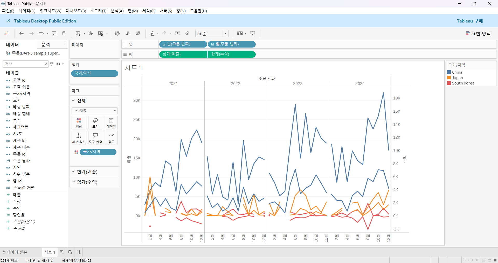

# Tableau 2주차 정규과제

📌Tableau 정규과제는 매주 정해진 **유튜브 강의를 통해 태블로 이론 및 기능을 학습한 후, 실습 문제를 풀어보며 이해도를 높이는 학습 방식**입니다. 

이번주는 아래의 **Tableau_2nd_TIL**에 명시된 유튜브 강의를 먼저 수강해주세요. 학습 중에는 주요 개념을 스스로 정리하고, 이해가 어려운 부분은 강의 자료나 추가 자료를 참고해 보완하세요. 과제 작성이 끝난 이후에는 **Github에 TIL과 실습 인증 결과를 업로드 후, 과제 시트에 제출해주세요.**


**(수행 인증샷은 필수입니다.)** 

> 태블로를 활용하는 과제인 경우, 따로 캡쳐도구를 사용하여 이미지를 첨가해주세요.


## Tableau_2nd_TIL

### 10. 차원과 측정값

### 11. 시각화

### 12. 막대 그래프

### 13. 누적막대 그래프

### 14. 병렬막대 그래프

### 15. 누적병렬막대 그래프

### 16. 라인 그래프

### 17. 맵 작성

### 18. 텍스트 레이블

### 19. 트리맵과 하이라이트 테이블


<br>

## 주차별 학습 (Study Schedule)

| 주차  | 공부 범위          | 완료 여부 |
| ----- | ------------------ | --------- |
| 1주차 | **강의 1 ~ 9강**   | ✅         |
| 2주차 | **강의 10 ~ 19강** | ✅         |
| 3주차 | **강의 20 ~ 29강** | 🍽️         |
| 4주차 | **강의 30 ~ 39강** | 🍽️         |
| 5주차 | **강의 40 ~ 49강** | 🍽️         |
| 6주차 | **강의 50 ~ 59강** | 🍽️         |
| 7주차 | **강의 60 ~ 69강** | 🍽️         |

<!-- 여기까진 그대로 둬 주세요-->


---

# 1️⃣ 학습 내용 정리

## 10강: 차원과 측정값

<!-- 차원과 측정값에 관해 배우게 된 점을 적어주세요 -->

> **🧞‍♀️ 차원과 측정값의 고유한 특성에 대해 설명해주세요.**

```
차원
  - 정성적인 값을 가지고 있는 필드
  - ex) 이름, 카테고리
  - 집계되지 않는 값을 가진 독립적 필드

측정값
  - 정량적인 값
  - 매출이나 수익 등의 집계되는 값

```

*Quiz: 차원은 불연속형이고, 측정값은 연속형이다 (o, x)*
yesyes OOOOOOOOOOOOOOO


## 11강: 시각화

<!-- 시각화 관해 배우게 된 점을 적어주세요 -->

뷰 작성할시 데이터 필드를 시트에 추가


주문 날짜 - 매출 클릭

다중라인 그래프 (드래그 - 드랍)

여기서 표현 방법 다르게 해서 다른 시각화 가능


ctrl 누른 채로 여러 테이블을 시트에 추가


*Quiz: 차원은 대부분 불연속형이며 표 형태로 시각화했을 때 머리글로 표시되고, 측정값은 대부분 연속형이므로 표 형태로 시각화 진행했을 때 패널로 추가된다.(o, x)*

yesyesOOOOOOOO


## 12강: 막대그래프

<!-- 막대그래프에 관해 배우게 된 점을 적어주세요 -->
막대그래프
- 매우 기본적인 시각화 방법
- 여러 범주의 데이터를 비교할때 유용


카테고리별 매출


행렬 바꾸기로 가로세로 바꾸기 가눙


카테고리를 색상, 매출을 레이블에 표시

## 13강: 누적막대그래프

<!-- 누적막대그래프에 관해 배우게 된 점을 적어주세요 -->
누적막대그래프
- 차원별로 측정값의 비중을 보여주기 위함
- 축을 활용하여 구성비의 변화 제공


카테고리별 매출을 백분율로 누적막대그래프 
<!-- 테이블(아래로)와 테이블(옆으로)의 계산 방식을 습득해보세요. 이에 관련해 아래 참고자료도 있습니다 :) -->


## 14강: 병렬막대그래프

<!-- 병렬막대그래프에 관해 배우게 된 점을 적어주세요 -->
병렬막대그래프
- 기본 막대그래프를 그룹화하여 나타냄

날짜는 불연속형 필드라 태블로가 시간의 흐름을 인식할 수 있도록 연속형으로 바꿔야함
- 테이블 원본에서 바꾸기
- 필드 위에서 바꾸기
- 오른쪽 클릭으로 가져와서 선택하기


2010~2014년의 주문일자


> *🧞‍♀️ 끊어진 색상으로 배치되어 표현되는 경우와 이어지는 그라데이션 색으로 표현되는 경우 두 가지가 있습니다. 위 사진의 경우 왜 색깔이 끊어지는 색상으로 표시되지 않고 그라데이션으로 표시되었나요? 데이터의 특성과 관련하여 이야기해 봅시다.*

```
Tableau에서 불연속형은 카테고리별로 끊어진 색상으로 표시

반대로 연속형은 값의 크기를 따라 그라데이션 색상으로 표현

-> Tableau가 자동으로 값의 크기를 따라 연속형 색상 그라데이션을 적용 
```


## 15강: 누적병렬막대그래프

<!-- 누적병렬막대그래프에 관해 배우게 된 점을 적어주세요 -->


할인-지역, 매출-카테고리별로 시각화

이중 축 사용


> *🧞‍♀️ 위 사진에서는 Profit과 Sales를 측정값으로 두었습니다.  개별 칼럼(태블로에서는 #필드라 명칭합니다)을 열/행에 두는 대신, '측정값'을 사용하고 측정값 선반에 필드를 올려둡니다. 이런 방식을 사용하는 이유가 무엇일지, 어떻게 사용할 수 있을지 고민해보세요*


```
이유

- 여러 지표를 동시에 비교
- 시각화의 일관성
- 동적/확장 가능성

-> 분석이 확장될 때 일관된 구조 유지 가능

활용
- 측정값 이름 + 측정값
- 하나의 시각화 안에서 다양한 지표 표현
```

<!-- 정답은 없습니다 -->


## 16강: 라인그래프

<!-- 라인그래프에 관해 배우게 된 점을 적어주세요 -->
라인그래프
- 데이터의 시간별 추세 확인
- 해당 데이터로 미래값 예측


## 17강: 맵작성

<!-- 맵차트 관해 배우게 된 점을 적어주세요 -->
지리적 역할
- 필드의 각 값을 위도와 경도에 연결

왜안돼ㅐㅐㅐㅐㅐ
```js
## 참고
Country/Region - 나라/지역
State/Province - 시/도
City - 시
County - 군
Postal Code - 우편번호
Area Code - 지역 코드
Airport - 공항
MSA/CBSA (Metropolitan Statistical Area) - 광역 통계 지역
Longitude - 경도
Latitude - 위도
```


## 18강: 텍스트테이블

<!-- 텍스트테이블에 관해 배우게 된 점을 적어주세요-->


## 19강: 트리맵과 하이라이트테이블

트리맵
- 직관적으로 시각화 비교 가능한 장점
- 데이터를 중첩된 사각형으로 표시


하이라이트 테이블
- 색상이 입혀진 특수 테이블
- 범주형 데이터를 색상으로 비교 가능


> *🧞‍♀️하이라이트 테이블 등에서 두개 이상의 측정값을 사용하는 경우, 함께 색을 표현하게 되면 단위가 달라 정확한 값을 표현할 수 없습니다. 이때 클릭해야 하는 항목은?*

```
측정값 이름
```


<br>

# 2️⃣ 확인문제

## 문제1

```js
지민이는 superstore의 한국 수출 관리 업무를 맡고 있습니다. 국가/지역이 우리나라, 즉 'South Korea'인 데이터만을 필터링하여, 상품 하위범주 별로 각 하위범주가 매출의 비율 중 얼마만큼을 차지하는지를 트리맵으로 확인하고 싶습니다. 트리맵의 각 네모 안에 표시되는 텍스트에는 **해당 범주의 이름과 전체에서 해당 범주가 차지하는 비율**이 표시되었으면 합니다.

지민이를 도와주세요! (풀이를 찾아가는 과정을 기술해주세요)
```

```
1. 필터링: 국가/지역 = South Korea

2. 트리맵 만들기

3. 매출 비율 계산

4. 레이블(범주명 + 비율) 표시

5. 색상 적용
```


## 문제2

```js
주현이는 국가/지역별로 매출과 수익의 증감을 시간에 흐름에 따라 표현하고자 합니다. 특히 **한국/중국/일본**을 비교하고자 해당 3국을 남기고 필터링했고, 3개 국가를 매출과 수익이라는 두 가지 지표로 확인해보았습니다.

아래는 위 설명을 표현해본 예시입니다.
```


```js
레퍼런스와 꼭 같지 않아도 자유롭게 표현하고, 그 과정을 기술해주세요.
```

```

```



### 참고 자료

```js
테이블 계산에서 '다음을 사용하여 계산'에는 테이블 당 계산과 패널 당 계산이 있습니다. 이에 대해 이해하는 것이 꼭 필요하기 때문에, 외부 레퍼런스를 참고하여 이 단계에서 꼭! 학습 후, 넘어가주세요 :)
```


[참고 외부자료 링크는여기를클릭하십시다](https://velog.io/@eunsuh/Tableau-%EB%A0%88%EB%B2%A8UP-%EA%B0%95%EC%9D%98-%EC%A0%95%EB%A6%AC-1-%ED%85%8C%EC%9D%B4%EB%B8%94-%EA%B3%84%EC%82%B0)

<br>

<br>

### 🎉 수고하셨습니다.
