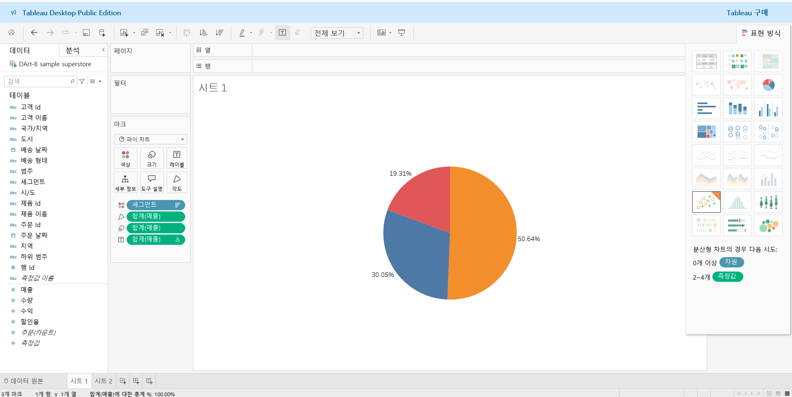
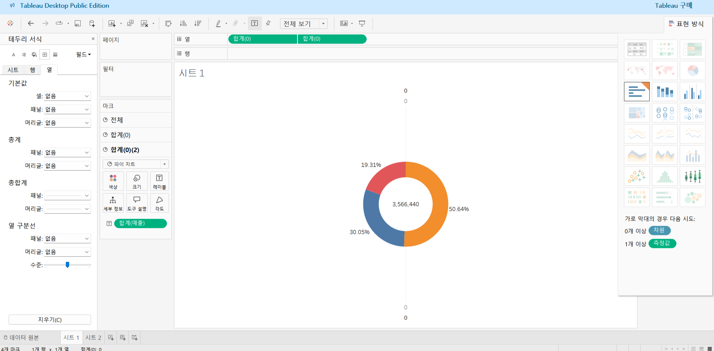
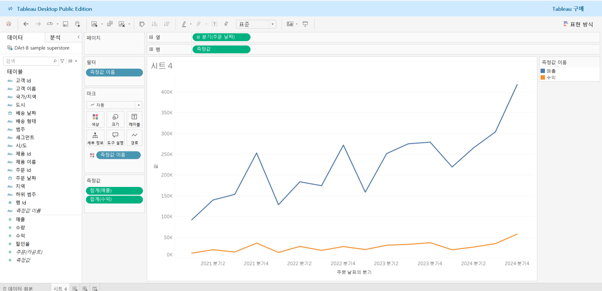
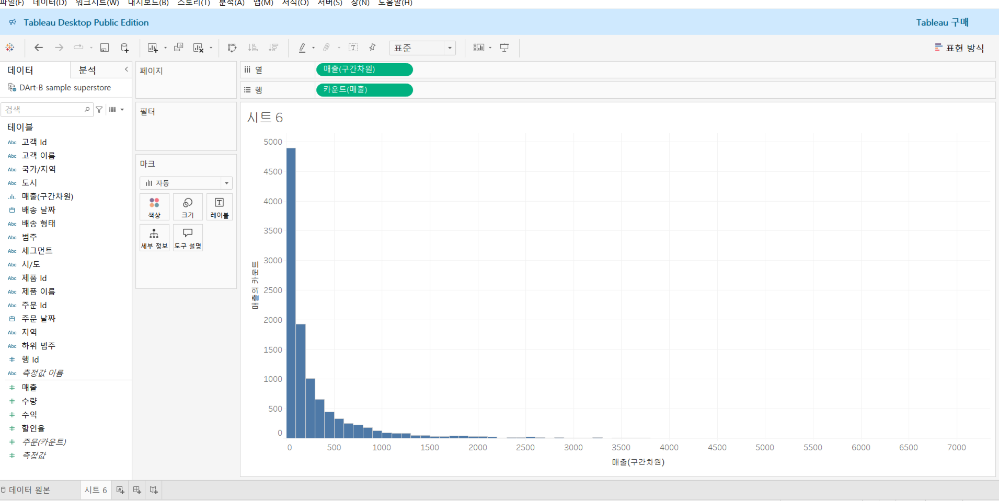
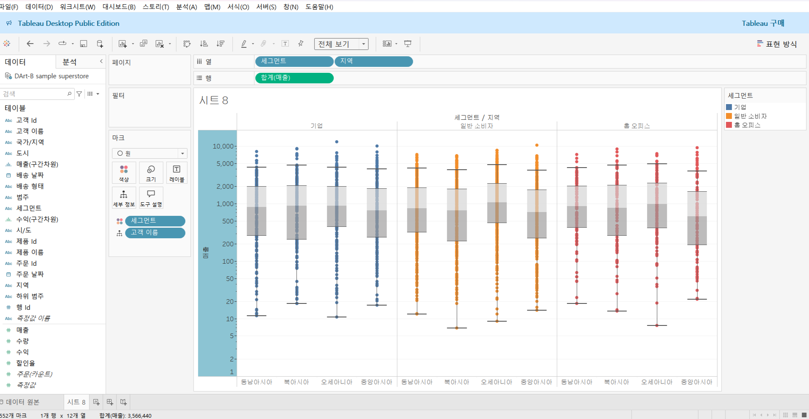
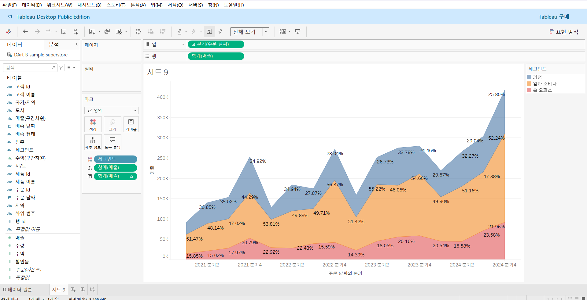
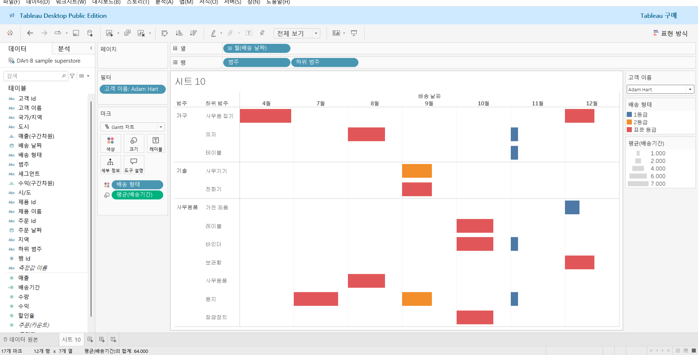
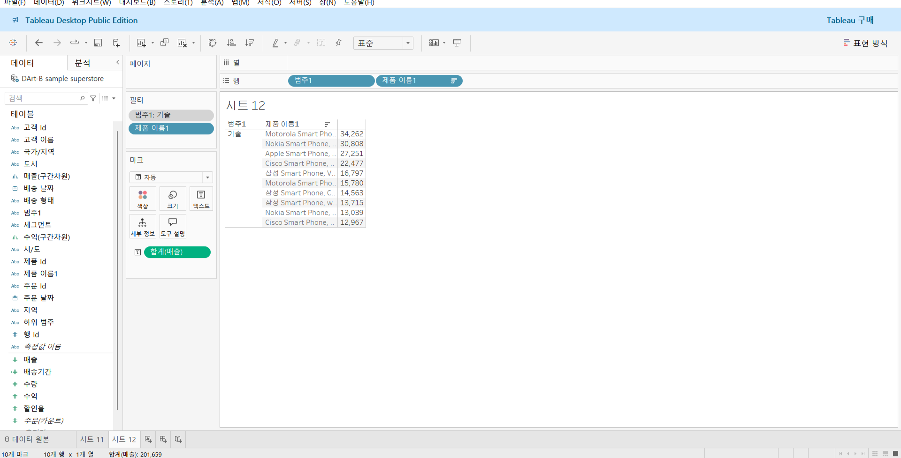

# Tableau 3주차 정규과제

📌Tableau 정규과제는 매주 정해진 **유튜브 강의를 통해 태블로 이론 및 기능을 학습한 후, 실습 문제를 풀어보며 이해도를 높이는 학습 방식**입니다. 

이번주는 아래의 **Tableau_3rd_TIL**에 명시된 유튜브 강의를 먼저 수강해주세요. 학습 중에는 주요 개념을 스스로 정리하고, 이해가 어려운 부분은 강의 자료나 추가 자료를 참고해 보완하세요. 과제 작성이 끝난 이후에는 **Github에 TIL과 실습 인증 결과를 업로드 후, 과제 시트에 제출해주세요.**


**(수행 인증샷은 필수입니다.)** 

> 태블로를 활용하는 과제인 경우, 따로 캡쳐도구를 사용하여 이미지를 첨가해주세요.


## Tableau_3rd_TIL

### 20. 파이와 도넛차트

### 21. 워드와 버블차트

### 22. 이중축과 결합축

### 23. 분산형 차트

### 24. 히스토그램

### 25. 박스 플롯

### 26. 영역차트

### 27. 간트차트

### 28. 필터

### 29. 그룹


<br>

## 주차별 학습 (Study Schedule)

| 주차  | 공부 범위          | 완료 여부 |
| ----- | ------------------ | --------- |
| 1주차 | **강의 1 ~ 9강**   | ✅         |
| 2주차 | **강의 10 ~ 19강** | ✅         |
| 3주차 | **강의 20 ~ 29강** | ✅         |
| 4주차 | **강의 30 ~ 39강** | 🍽️         |
| 5주차 | **강의 40 ~ 49강** | 🍽️         |
| 6주차 | **강의 50 ~ 59강** | 🍽️         |
| 7주차 | **강의 60 ~ 69강** | 🍽️         |

<!-- 여기까진 그대로 둬 주세요-->


---

# 학습 내용 정리

## 20강: 파이와 도넛차트
<!-- 파이와 도넛차트에 관해 배우게 된 점을 적어주세요 -->

파이 차트
- 전체에 대한 비율을 표시할때 사용

> **🧞‍♀️ 도넛차트를 생성하는 법을 기록해주세요.**
- 파이차트에서 이중 축 사용
- 파이차트 위에 작은 원 하나 추가
- 열 선반에 0 입력 후 임의 축 생성
- ctrl 누르고 드래그 시 축 두개 생성



## 21강: 워드와 버블차트

<!-- 워드와 버블차트에 관해 배우게 된 점을 적어주세요 -->
1. 버블 차트
- 수치적 데이터를 원의 크기로 표현

2. 워드클라우드
- 문서 내에서 키워드가 얼마나 자주 등장하는지
- 텍스트 크기로 직관적 시각화


## 22강: 이중축과 결합축

<!-- 이중축과 결합축에 관해 배우게 된 점을 적어주세요 -->
1. 이중 축
- 하나의 뷰어 안에서 축을 이중으로 사용
- 마크를 각각의 축에 개별 적용


2. 결합된 축
- 하나의 축을 공유하는 차트
- 축을 공유하는 측정값을 필요에 따라 추가


## 23강: 분산형 차트

<!-- 분산형 차트에 관해 배우게 된 점을 적어주세요 -->
분산형 차트
- 파라미터 간의 상관관계를 파악

```js
강의 영상과 달리, 우리 파일에는 '제조 업체' 필드가 없습니다. 필요한 경우, 계산된 필드를 이용해 'SPLIT([제품 이름], ' ', 1)'를 '제조 업체'로 정의하시고 세부 정보에 놓아주세요.
```


## 24강: 히스토그램

<!-- 히스토그램에 관해 배우게 된 점을 적어주세요 -->
히스토그램
- 분포 형태를 표시
- 막대그래프와 비슷
- 불연속형이 아닌 연속형 값을 그룹화
- 차원 필드 없이 측정값만으로 그래프를 그림
- 구간차원: 일정한 크기의 포켓을 만들어 값을 담아 표현하기 위한 도구


 


## 25강: 박스플롯

<!-- 박스플롯에 관해 배우게 된 점을 적어주세요 -->
박스플롯
- 데이터의 분포를 파악하는데 사용
- 다섯 개의 구간을 그림으로 표현
- 분포나 이상치 등을 한 눈에 볼 수 있음
- 사분위 (Q1, Q2, Q3) 사용
- IQR = Q3 - Q1



## 26강: 영역차트

<!-- 영역차트에 관해 배우게 된 점을 적어주세요 -->
영역 차트
- 라인과 축 사이의 공간이 생상으로 채워진 차트
- 연속형 데이터의 누계를 표현



## 27강: 간트차트

<!-- 간트차트에 관해 배우게 된 점을 적어주세요 -->
간트 차트
- 시간 경과에 따른 기간을 시각화


## 28강: 필터

<!-- 필터에 관해 배우게 된 점을 적어주세요 -->
추출 필터
- 저장 주소에 있는 로컬 데이터만 연결 후 작업

데이터 원본 필터
- 작업을 위한 데이터 중 일부만 불러올 때

컨텍스트 필터
- 필터 중 상위 필터
- 다른 필터가 이 필터에 종속되어 작동


## 29강: 그룹

<!-- 그룹에 관해 배우게 된 점을 적어주세요 -->
그룹
- 수동으로 필드의 항목들을 묶을 수 있음
- 원본에 없는 사용자 지정 필드를 만들 수 있음
- 뷰에서 해당 그룹을 드래그해 설정


# 확인문제

## 문제 1.

```js
푸앙이는 superstore 데이터셋에서 '주문' 테이블을 보고 있습니다.
1) 국가/지역 - 시/도- 도시 의 계층을 생성했습니다. 계층 이름은 '위치'로 설정하겠습니다.
2) 날짜의 데이터 타입을 '날짜'로 바꾸었습니다.

코로나 시기의 도시별 매출 top10을 확인하고자
1) 배송 날짜가 코로나시기인 2021년, 2022년에 해당하는 데이터를 필터링했고
2) 위치 계층을 행으로 설정해 펼쳐두었습니다.
이때, 매출의 합계가 TOP 10인 도시들만을 보았습니다.
```


```
겉보기에는 전체 10개로, 잘 나온 결과처럼 보입니다. 그러나 푸앙이는 치명적인 실수를 저질렀습니다.
오늘 배운 '컨텍스트 필터'의 내용을 고려하여 올바른 풀이 및 결과를 구해주세요.
```
실수: 도시 Top 10 필터가 일반 차원 필터인 배송 날짜보다 먼저 계산됨

배송 날짜를 컨텍스트 필터로 설정해야함


<!-- DArt-B superstore가 아닌 개인 superstore 파일을 사용했다면 값이 다르게 표시될 수 있습니다.-->


## 문제 2.

```js
미정이는 관심이 있는 제품사들이 있습니다. '제품 이름' 필드에서 '삼성'으로 시작하는 제품들을 'Samsung group'으로, 'Apple'으로 시작하는 제품들을 'Apple group'으로, 'Canon'으로 시작하는 제품들을 'Canon group'으로, 'HP'로 시작하는 제품들을 'HP group', 'Logitech'으로 시작하는 제품들을 'Logitech group'으로 그룹화해서 보려고 합니다. 나머지는 기타로 설정해주세요. 이 그룹화를 명명하는 필드는 'Product Name Group'으로 설정해주세요.

(이때, 드래그보다는 멤버 찾기 > 시작 문자 설정하여 모두 찾아 한번에 그룹화해 확인해보세요.)
```


```js
해당 그룹별로 어떤 국가/지역이 주문을 많이 차지하는지를 보고자 합니다. 매출액보다는 주문량을 보고 싶으므로, 주문Id의 카운트로 계산하겠습니다.

기타를 제외하고 지정한 5개의 그룹 하위 목들만을 이용해 아래와 같이 지역별 누적 막대그래프를 그려봐주세요.
```

이쁘게나온듯

<br>

<br>

### 🎉 수고하셨습니다.
