# Tableau 스터디 2주차 정리

## Ep.5 태블로 부분 전체 분석

**누적 막대 차트**

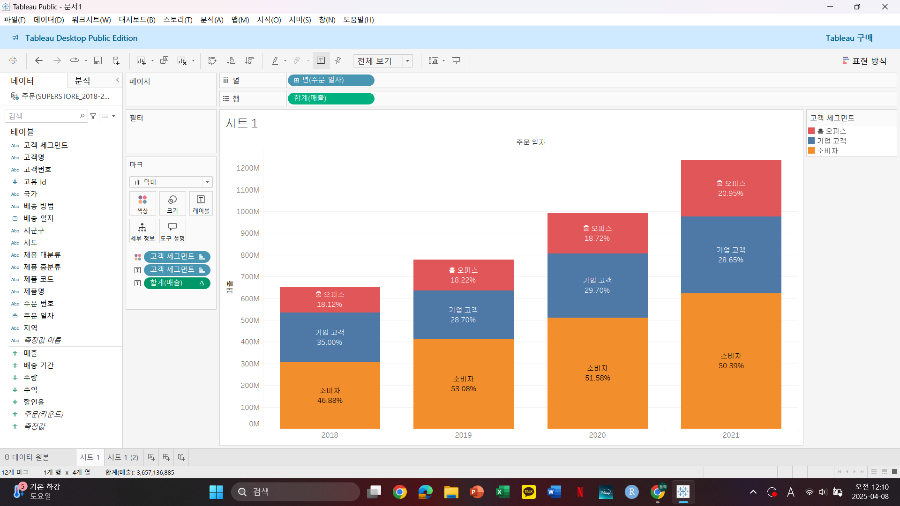

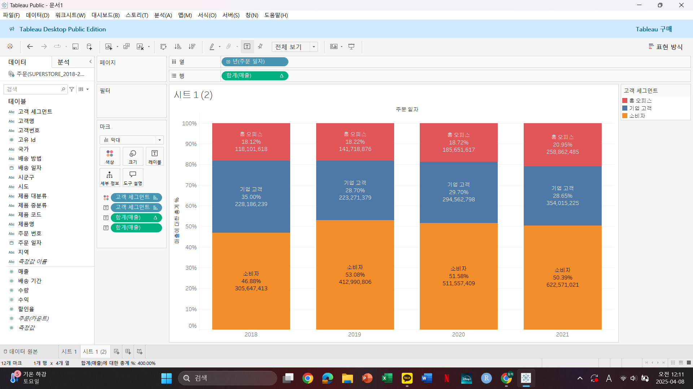

레이블 중 합계(매출)의 세모는 테이블 계산이 된다는 뜻

**파이 차트 / 도넛 차트**

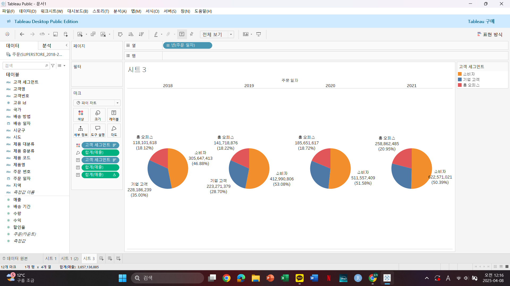

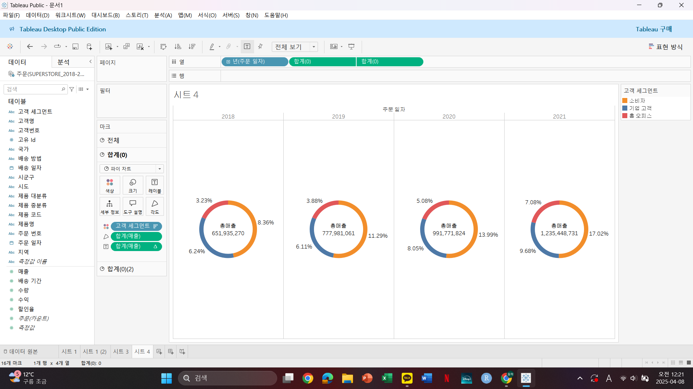

복합적인 차트를 한 번에 보기에는 도넛 차트가 편리

**트리맵**

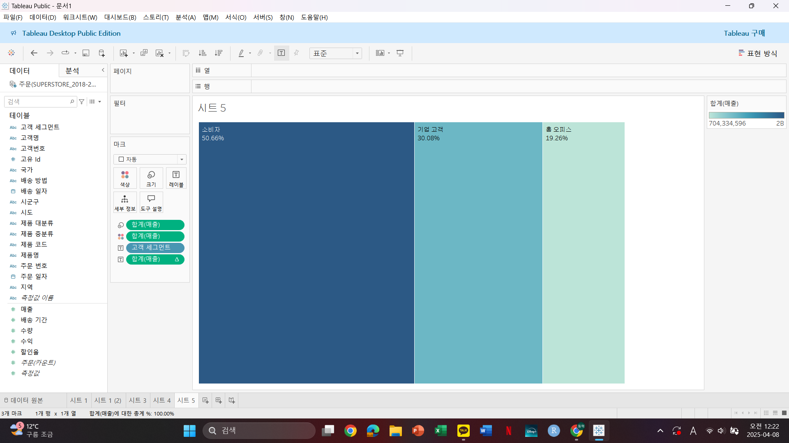

파이차트에 항목이 너무 많아 비효율적일 때는 트리맵이 더 효율적

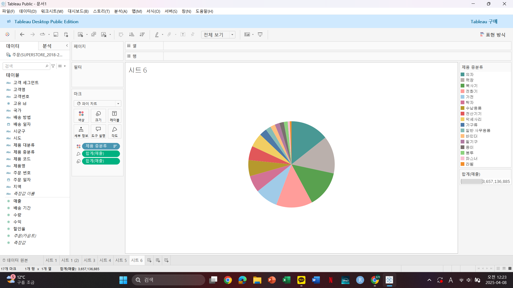

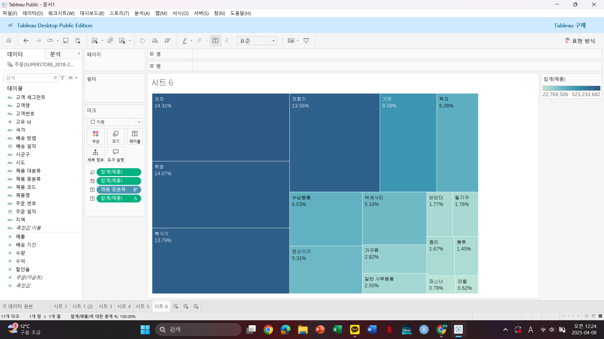

## Ep.6 태블로 상관 관계 분석

**분산형 차트 ,매개변수**

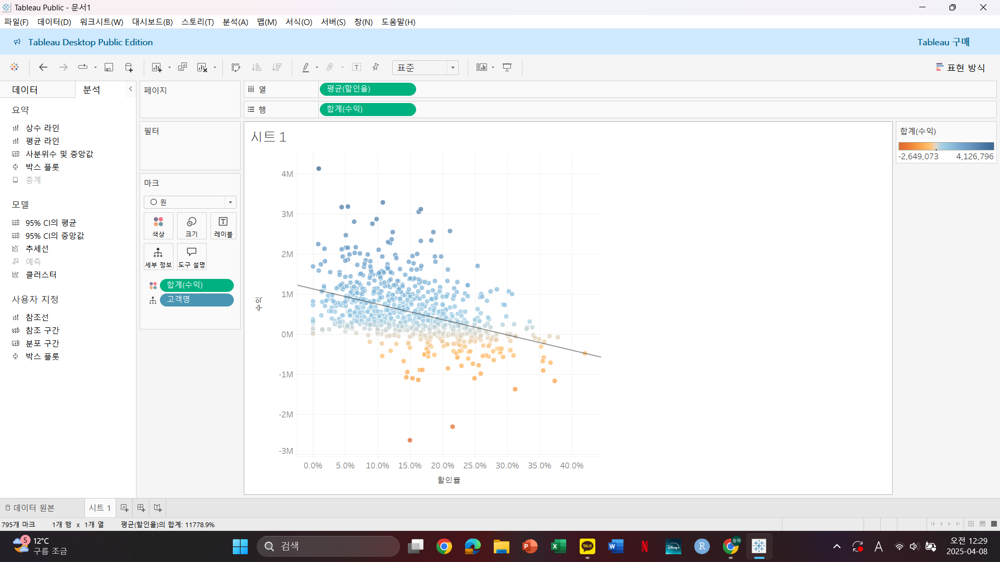

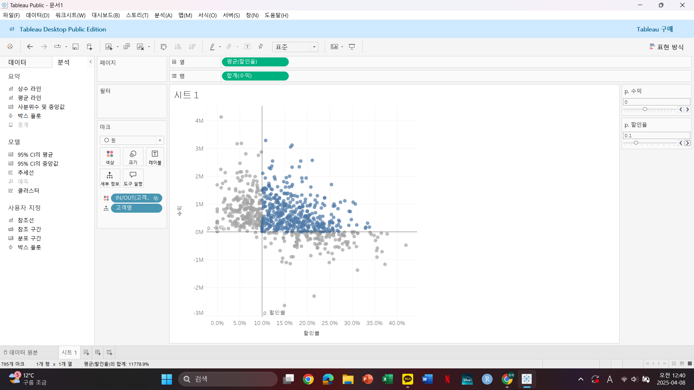

분산형 차트는 측정값 간의 관계를 파악

매개변수를 만들어 다양하게 활용 가능

데이터 분석 기능은 자꾸 렉이 걸려 실패..

## Ep.7 태블로 이중 축 vs 결합된 축

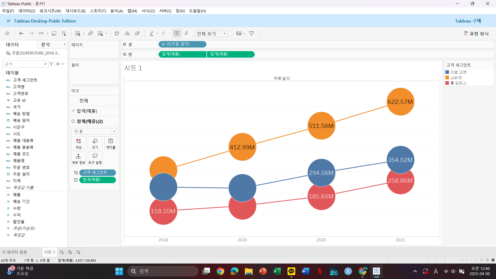

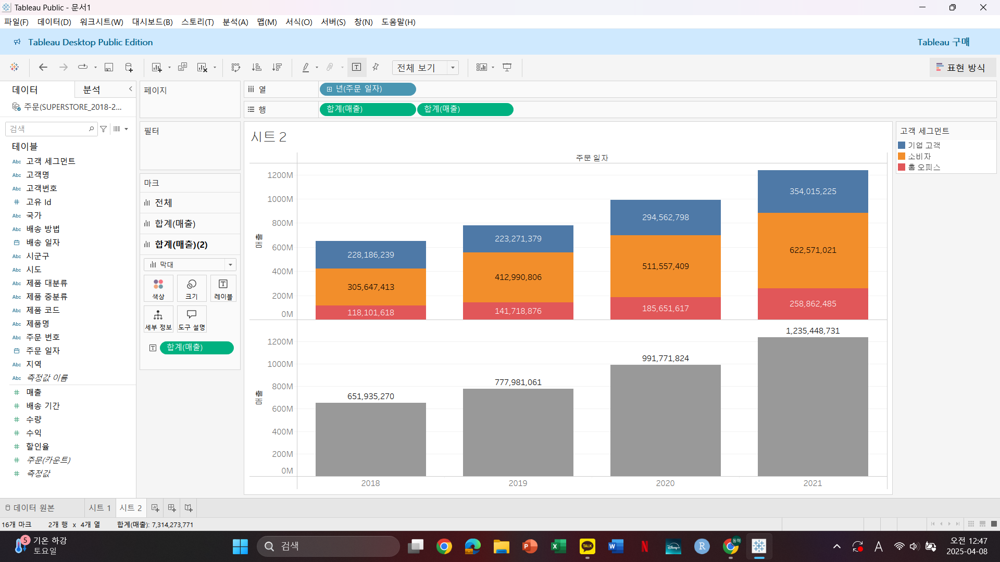

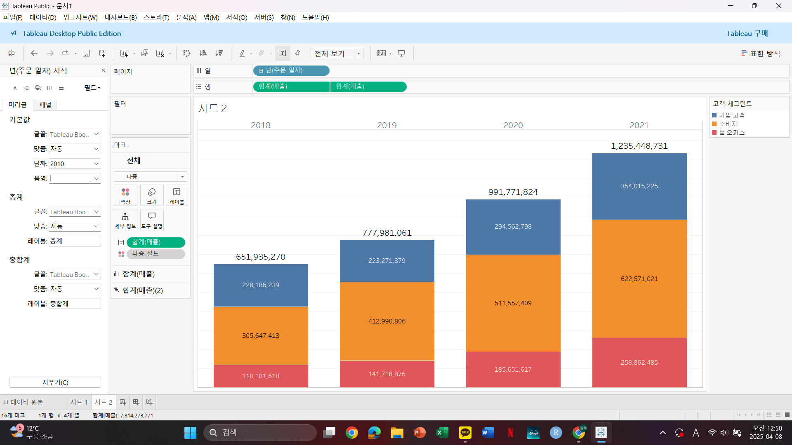

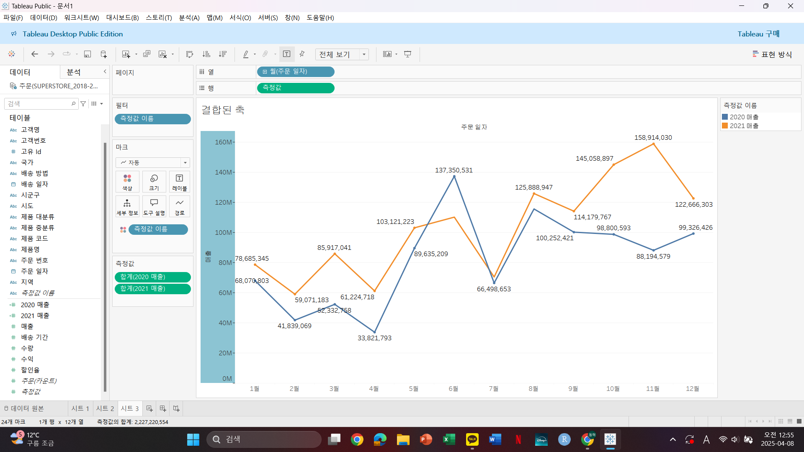

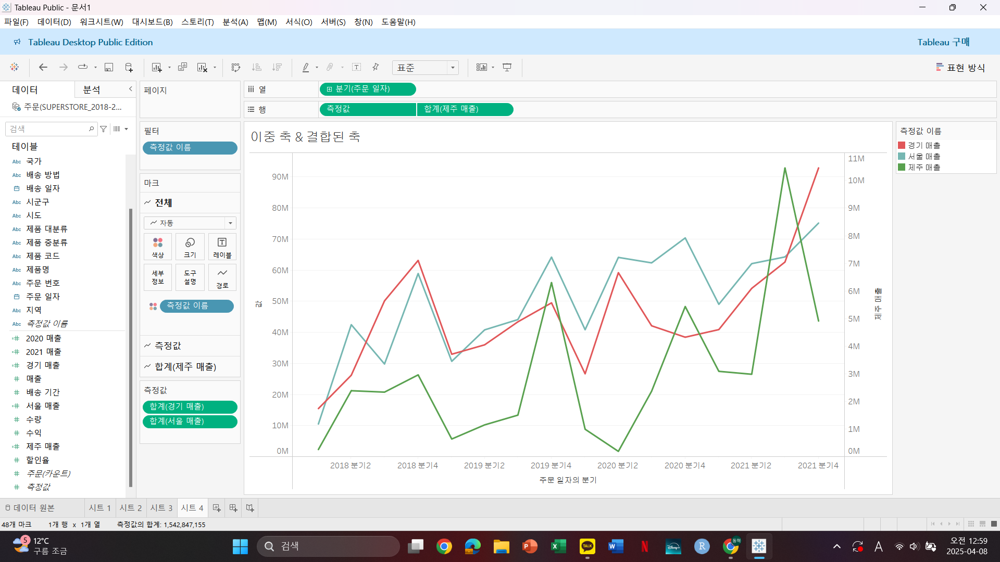

이중 축은 하나의 뷰 안에서 축을 이중으로 써서 차트 생성  -> 마크 다르게 가능

결합된 축은 하나의 뷰에서 같은 축을 결합 또는 공유 -> 마크 동일 구성 